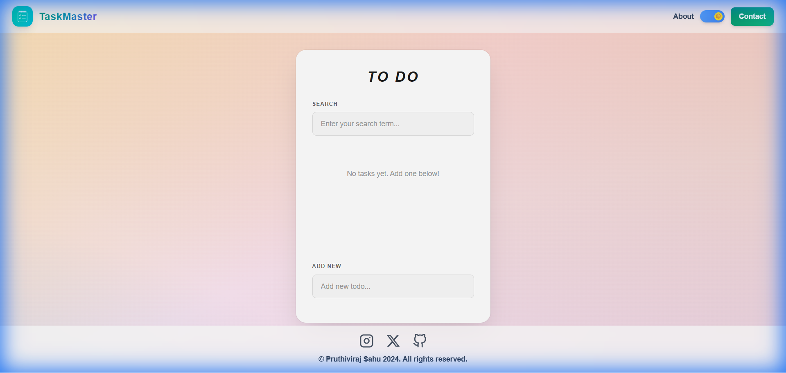
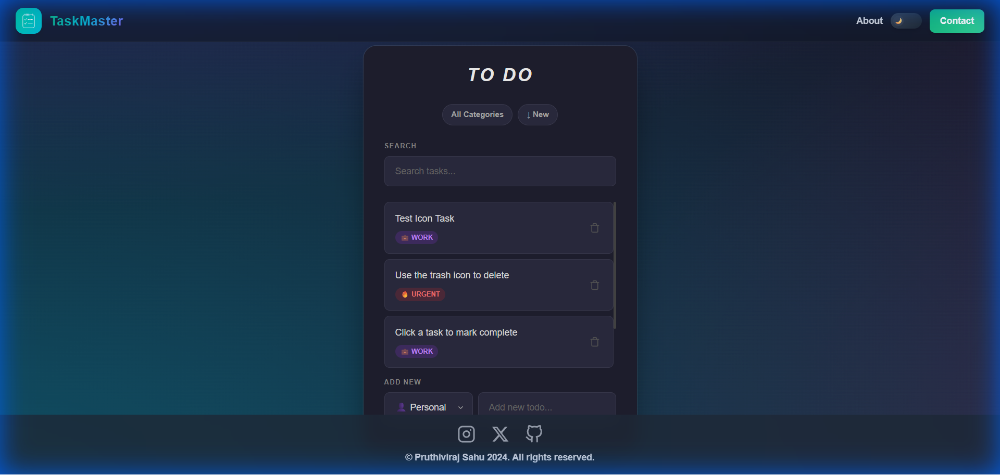

# TaskMaster - Minimal React To-Do App

A modern, minimal, and feature-rich To-Do list application built with **React**, **Vite**, and **Tailwind CSS**. Designed for focus and efficiency with a beautiful clean UI.

## ✨ Features

### 🎨 Minimal & Modern UI
- **Glassmorphism Design**: Sleek animated mesh gradients and soft shadows.
- **Dark Mode Support**: Fully responsive dark/light styling that auto-adapts to your preference.
- **Responsive Layout**: Works seamlessly on desktop and mobile.

### 🚀 Smart Task Management
- **Categorization**: Organize tasks into **Personal** 👤, **Work** 💼, and **Urgent** 🔥.
- **Visual Tags**: Color-coded pills for quick scanning of task types.
- **Sorting & Filtering**:
  - Filter tasks by category.
  - Sort by **Newest**, **Oldest**, or **A-Z**.
- **Search**: Instant real-time filtering of tasks by name.

### 🛠️ Technical Highlights
- **Tech Stack**: React 18, Vite, Tailwind CSS.
- **Persistence**: Tasks are saved strictly to `localStorage` (no backend required).
- **Custom Components**:
  - Pixel-perfect custom dropdowns.
  - Integrated Gmail composition button.
  - Interactive SVG icons.

## 📦 Installation

1. Clone the repository:
   ```bash
   git clone https://github.com/Pruthivi13/OIBSIP_task3.git
   ```
2. Navigate to the project folder:
   ```bash
   cd OIBSIP_task3/todo-react
   ```
3. Install dependencies:
   ```bash
   npm install
   ```
4. Start the dev server:
   ```bash
   npm run dev
   ```

## 🖼️ Screenshots

### Light Mode


### Dark Mode


---
Code by [Pruthivi13](https://github.com/Pruthivi13)
